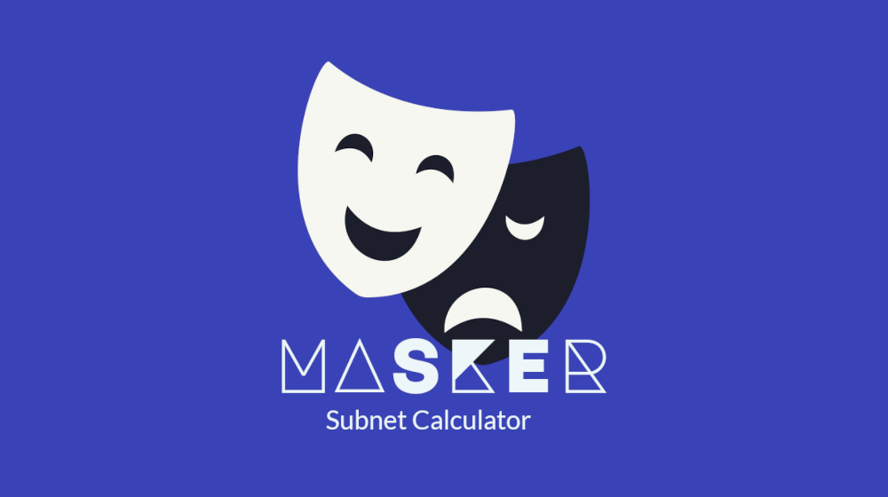

<h1 align="center">
    
</h1>

<strong>Masker 🎭 Em progresso</strong>

    <a href="#sobre">Sobre</a> .
    <a href="#funcionalidades">Funcionalidades</a> .
    <a href="#demonstração">Demonstração</a> .
    <a href="#como-usar">Como usar?</a> .
    <a href="#ferramentas">Ferramentas</a>

# Sobre

Lorem ipsum dolor sit amet consectetur adipisicing elit. Laudantium cum assumenda numquam animi magnam, voluptatum inventore cupiditate distinctio. Numquam nemo rem corporis unde ut inventore voluptas id totam deleniti quod!

# Funcionalidades

- Lorem
- Ipsum
- Dolor
- Sit
- Amet

# Demonstração

WIP

# Como usar?

WIP

# Ferramentas

## Desenvolvimento

- [React](https://reactjs.org/)
- [Typescript](https://www.typescriptlang.org/)
- [create-react-app](https://create-react-app.dev/)
- [Visual Studio Code](https://code.visualstudio.com/)
- [Yarn](https://yarnpkg.com/)

## Fontes

- [Lato](https://fonts.google.com/specimen/Lato) designed by Łukasz Dziedzic
- [Major Mono Display](https://fonts.google.com/specimen/Major+Mono+Display) designed by Emre Parlak
- [Nunito](https://fonts.google.com/specimen/Nunito) designed by Vernon Adams, Cyreal